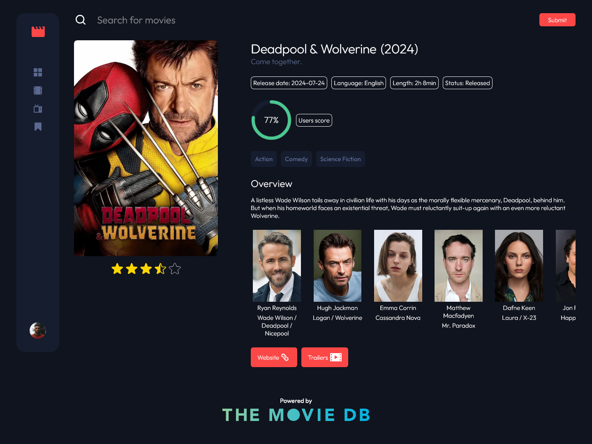

# Frontend Mentor - Entertainment web app solution

This is a solution to the [Entertainment web app challenge on Frontend Mentor](https://www.frontendmentor.io/challenges/entertainment-web-app-J-UhgAW1X). Frontend Mentor challenges help you improve your coding skills by building realistic project.

## Table of contents

- [Overview](#overview)
  - [The challenge](#the-challenge)
  - [Screenshot](#screenshot)
  - [Links](#links)
- [My process](#my-process)
  - [Built with](#built-with)
  - [What I learned](#what-i-learned)
  - [Continued development](#continued-development)
  - [Useful resources](#useful-resources)
- [Author](#author)

## Overview

### The challenge

Users should be able to:

- View the optimal layout for the app depending on their device's screen size
- See hover states for all interactive elements on the page
- Navigate between Home, Movies, TV Series, and Bookmarked Shows pages
- Add/Remove bookmarks from all movies and TV series
- Search for relevant shows on all pages
- **Bonus**: Build this project as a full-stack application
- **Bonus**: If you're building a full-stack app, we provide authentication screen (sign-up/login) designs if you'd like to create an auth flow

### Screenshot

### Links

- Solution URL: [https://github.com/PioKl/Entertainment-Web-App]
- Live Site URL: [https://entertainment-web-app-five-brown.vercel.app/]

## My process

### Built with

- Semantic HTML5 markup
- CSS custom properties
- Flexbox
- CSS Grid
- Mobile-first workflow
- [Next.js](https://nextjs.org/) - React Framework
- [React](https://reactjs.org/) - JS library
- [Typescript](https://www.typescriptlang.org/) - JS syntax
- [Swiper](https://swiperjs.com/) - Modern Mobile Touch Slider
- [SWR](https://swr.vercel.app/) - React Hooks for Data Fetching
- [SVGR](https://react-svgr.com/docs/next/) - Transform SVGs into React components
- [File-Loader](https://www.npmjs.com/package/file-loader) - The file-loader resolves import/require() on a file into a url and emits the file into the output directory.
- [MUI](https://mui.com/) - Material UI, React UI framework
- [React-Fontawesome](https://docs.fontawesome.com/web/use-with/react) - Font Awesome React component using SVG with JS

### What I learned

Practice with: Next and React (hooks, custom hooks, useEffect, routing, navigation with next, modals, swiper, reusable components, swr fetching method, work with api, usage of layouts in next, transforming svg into component, usage of Image in next, work with iframe, pagination with mui) and Typescript (generally and types/interface), grid, flex. Working with mongodb, creating working auth, image upload and bookmarks with mongo and node.

### Useful resources

- [Clamp Calculator](https://www.marcbacon.com/tools/clamp-calculator/) - To clamp fonts

## Author

- Website - [PioKl](https://github.com/PioKl)
- Frontend Mentor - [@PioKl](https://www.frontendmentor.io/profile/PioKl)
